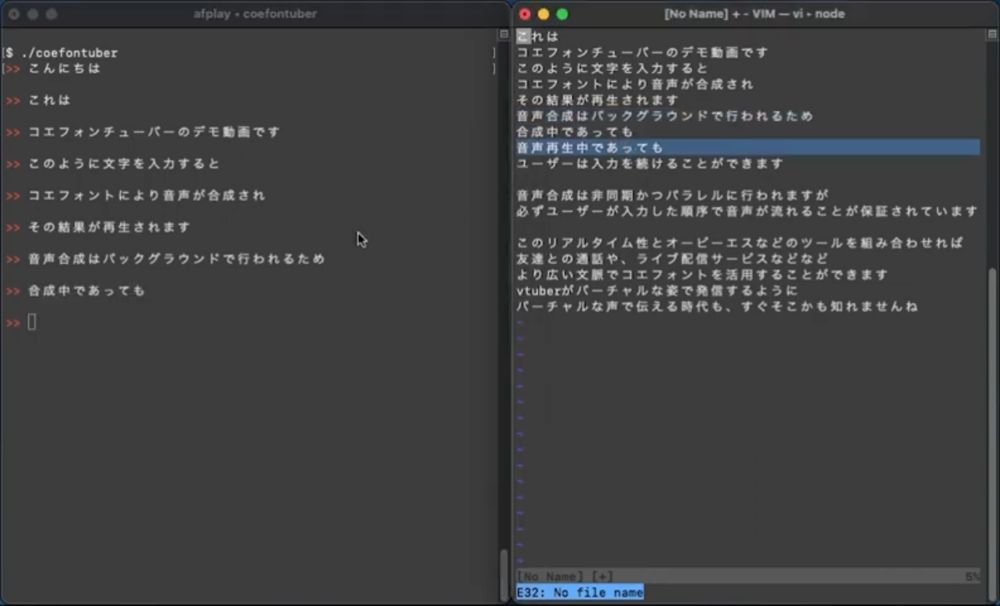

# Coefontuber

Coefontuber, which is named after [CoeFont](https://coefont.cloud/coefonts) + [YouTuber](https://www.youtube.com/), is an interactive and cross-platform CUI client for CoeFont.

As a vtuber streams a live with his/her virtual appearance, Coefontuber lets you *speak* with a virtual voice. Even sound effects such as echo are supported.

It is written in Go.

| [](https://www.youtube.com/watch?v=e4FaFSA-_7g) |
|:-:|
| Demo |

# 1. How It Works

Say you want to make Coefontuber speak "hello", "world" and "bye". Here is what is happening under the hood:

1. `main()` reads your inputs (i.e. "hello", "world" and "bye") using [GNU Readline](https://tiswww.case.edu/php/chet/readline/rltop.html).

2. `main()` spawns a pair of `APICall()` and `Play()` for each input. All of such functions start running right away, and they are all asynchronous.

3. `APICall()` sends a string to CoeFont and passes the resultant `.wav` file to the corresponding `Play()` using a [*channel*](https://go.dev/ref/spec#Channel_types). CoeFont works as a text-to-speech converter. Note that which `APICall()` returns first is undefined. It is possible `(E)` or `(F)` in the figure below returns before `(D)` returns though `(D)` is spawned first.

4. `Play()` waits for the corresponding `APICall()` to give it a `.wav` file. In addition, it waits for the *adjacent* `Play()` which has been spawned right before it to return. This implies that, before `Play()` returns, it notifies *"I'm done."* to the adjacent `Play()`. By that, even if sequentially spawned `APICall()`s don't return in that order, it is guaranteed that `Play()`s speak in that order. These *"I'm done."* communications are also done via channels named `batonIn` (for listening) and `batonOut` (for notifying). Each instance of `batonIn` or `batonOut` is shared only by two adjacent `Play()`s. For example, if a `batonOut` is passed to `(B)` in the figure below as an argument, it is copied only once and passed to `(C)` as `batonIn`.

|  |
|:-:|
| Figure: How Coefontuber Works |

# 2. Prerequisites

## 2.1 Sign Up

1. Sign up for [CoeFont](https://coefont.cloud/).

2. Visit [https://coefont.cloud/account/api](https://coefont.cloud/account/api) to generate a key for CoeFont API.

## 2.2 Requirements

- [SoX](https://github.com/chirlu/sox) (We call `play` command bundled with SoX.)

# 3. Configurations

## 3.1 Configuration File

Coefontuber reads `./config.json` as the configuration file.

You don't need to write `./config.json` from scratch; just `cp ./template_config.json ./config.json`.

Here is an example:

```json
{
    "coefont": { //Normally, this is the only section you might want to edit.
        "access_key":    "vWuJOxgUZcJGNV4aCZA0dXHlK",
        "client_secret": "y5Fsd7GDfspJnFaqszqOsxSF729je6SecIkevyC6",
        "font_uuid":     "6c0540f7-9639-4d2b-ae8c-43572d9d7f79",
        "speed":         1.0
    },
    "readline": { //Never edit this section unless you know what is GNU Readline.
        "vim_mode":     false,
        "history_file": "./.history"
    },
    "output_dir":  "./wav",
    "timeout_sec": 10,
    "custom_prefix_list": [
        {
            "prefix": "echo",
            "args": [
                "echo",
                "0.8",
                "0.88",
                "60",
                "0.4"
            ]
        }
    ]
}
```

## 3.2  `custom_prefix_list` (Sound Effects)

The configuration field `custom_prefix_list` registers additional arguments to the `play` command used to play generated WAV files.

With the example configuration above, if you for example input
```
!echo hello world
```

in an interactive session, then
```bash
play hello_world.wav echo 0.8 0.88 60 0.4
```

is executed under the hood.

Using this, you can apply [any effects supported by SoX](http://sox.sourceforge.net/sox.html#EFFECTS).

You can type `!list` to list all of the prefixes you've registered.

# 4. Usage

## 4.1 Build

```bash
go build
```

## 4.2 Run

```bash
./coefontuber #starts an interactive session
```

# 5. Development Notes

Run `./lint.sh` before you commit.

<!-- vim: set spell: -->

